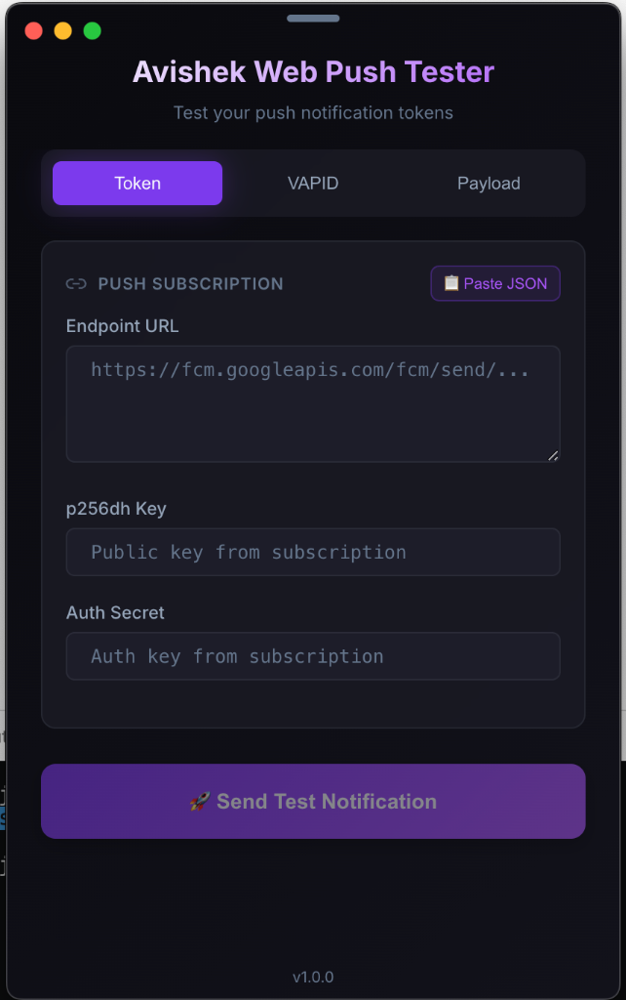

# Avishek Web Push Tester

A sleek, Mac widget-style desktop tool for testing web push notification tokens.


## ✨ Features

- 🎨 **Modern Dark UI** - Glassmorphism design with smooth animations
- 🔐 **Encrypted Storage** - VAPID keys saved securely on your machine
- 📋 **Quick JSON Paste** - Paste subscription JSON directly from your browser console
- 🔍 **Detailed Error Messages** - Clear explanations for common push errors
- 💾 **Session Persistence** - Your settings are saved between sessions

## 📸 Screenshots

<p align="center">
  
</p>

<p align="center">
  <em>Sleek dark mode interface with glassmorphism design</em>
</p>

## 📦 Installation

### Option 1: Download DMG (Recommended)

1. Download the latest `.dmg` from [Releases](https://github.com/avishek-chatterjee/web-push-tester/releases)
2. Open the DMG and drag the app to Applications
3. Launch from Applications folder

### Option 2: Build from Source

```bash
# Clone the repository
git clone https://github.com/avishek-chatterjee/web-push-tester.git
cd web-push-tester

# Install dependencies
npm install

# Run in development mode
npm run electron:dev

# Build for production
npm run dist
```

## 🚀 Usage

### 1. Get Your Push Subscription

In your browser console where you have a service worker registered:

```javascript
const subscription = await registration.pushManager.getSubscription()
console.log(JSON.stringify(subscription, null, 2))
```

Copy the output JSON.

### 2. Enter Subscription Details

Click the "📋 Paste JSON" button to quickly fill in the subscription details, or manually enter:

- **Endpoint URL** - The push service URL
- **p256dh Key** - The public key from the subscription
- **Auth Secret** - The authentication secret

### 3. Configure VAPID Keys

Enter your VAPID keys (these can be saved locally for reuse):

- **Public Key** - Your VAPID public key
- **Private Key** - Your VAPID private key (stored encrypted)
- **Subject** - Your mailto: email address

### 4. Customize Notification

Set up your test notification:

- **Title** - Notification title (required)
- **Body** - Notification message
- **Icon/Badge URLs** - Optional icons
- **Tag** - For replacing existing notifications

### 5. Send Test

Click "🚀 Send Test Notification" and check the result!

## 🛠️ Development

```bash
# Install dependencies
npm install

# Start development server
npm run electron:dev

# Build for production
npm run build

# Create distributable
npm run dist
```

## 📝 License

MIT © Avishek Chatterjee

---

Made with ❤️ for developers who need to debug push notifications
